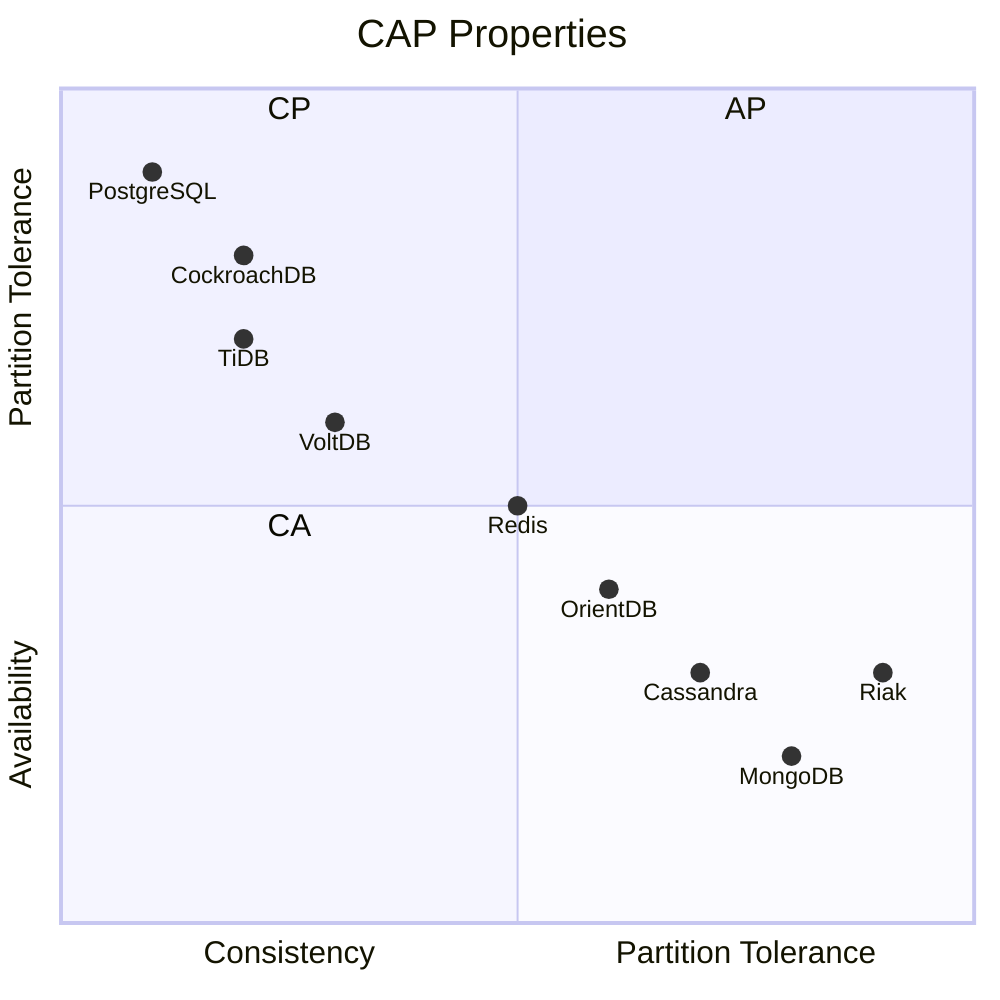

OVERVIEW
========

This project will help get you started understanding the tradeoffs of various data storage approaches.

`docker compose up`

READING MATERIAL
----------------

How do you approach the problem of deciding what is real based upon (possibly fully-) decentralized communications?
What are the limitations on our ability to determine what is real?

- [Byzantine Generals Problem](https://lamport.azurewebsites.net/pubs/byz.pdf)
- [Byzantine Fault](https://en.wikipedia.org/wiki/Byzantine_fault)
- [Brain In Vat (BIV) Thought Experiment](https://en.wikipedia.org/wiki/Brain_in_a_vat)

Those show that consensus is not always simple to achieve. What's more, our ability to fine-tune a solution is limited
by the CAP Theorem.

- [CAP Theorem (wiki)](https://en.wikipedia.org/wiki/CAP_theorem)
- [CAP Theorem (paper)](https://users.ece.cmu.edu/~adrian/731-sp04/readings/GL-cap.pdf)

Rather than Byzantine Generals, we have what sounds like a Hollywood trio:

- [Actors](https://arxiv.org/vc/arxiv/papers/1008/1008.1459v8.pdf)
- [Agents](https://en.wikipedia.org/wiki/Agent-based_model)
- [Gossip](https://en.wikipedia.org/wiki/Gossip_protocol)

A problem introduced with all the gossip, is many more messages being passed around. If you a mechanism
to provided a consistent hash code for a data record, you can reduce the size of messages by relying
on the hash code to determine if the data is the same. What's more, you can use this property to split
the data into multiple parts and distribute it across multiple nodes. This is the basis for the
[Consistent Hashing](https://en.wikipedia.org/wiki/Consistent_hashing) algorithm. [Riak](https://riak.com/)
is a great database for exploring this concept under the hood.

Interesting examples of distributed systems:

- [Paxos](https://en.wikipedia.org/wiki/Paxos_(computer_science))
- [Chubby](https://static.googleusercontent.com/media/research.google.com/en//archive/chubby-osdi06.pdf)
- [Erlang](https://en.wikipedia.org/wiki/Erlang_(programming_language))
- [Raft](https://en.wikipedia.org/wiki/Raft_(computer_science))
- [DynamoDB](https://www.allthingsdistributed.com/files/amazon-dynamo-sosp2007.pdf)

DATABASES
---------

This repository provides a Docker Compose setup for multiple popular open-source databases. The included databases are:

1. [**PostgreSQL**](https://www.postgresql.org/)
2. [**MongoDB**](https://www.mongodb.com/)
3. [**Redis**](https://redis.io/)
4. [**Riak**](https://riak.com/)
5. [**Cassandra**](https://cassandra.apache.org/)
6. [**OrientDB**](https://orientdb.org/)
7. [**CockroachDB**](https://www.cockroachlabs.com/product/cockroachdb/)
8. [**VoltDB**](https://www.voltdb.com/)
9. [**TiDB**](https://pingcap.com/)

---

### 1. [PostgreSQL](https://www.postgresql.org/)

- **Service Name**: `postgresql`
- **Description**: PostgreSQL is a powerful, open-source object-relational database system with over 30 years of active
  development. It has a strong reputation for reliability, feature robustness, and performance.
- **Architecture**: Single-node relational database.
- **Consistency**: ACID compliance.
- **Scalability**: Vertical scaling; limited horizontal scaling with sharding.
- **Query Languages**: [Standard SQL](https://www.postgresql.org/docs/current/sql.html).
- **Use Cases**: General-purpose database, suitable for web, mobile, and analytics applications.
- **Ports**: `5432`
- **Environment Variables**:
    - `POSTGRES_USER`: `admin`
    - `POSTGRES_PASSWORD`: `admin`
    - `POSTGRES_DB`: `testdb`
- **CAP Theorem**: CA (Consistent and Available)

### 2. [MongoDB](https://www.mongodb.com/)

- **Service Name**: `mongodb`
- **Description**: MongoDB is a document-oriented NoSQL database used for high volume data storage. It stores data in
  flexible, JSON-like documents, meaning fields can vary from document to document and data structure can be changed
  over time.
- **Architecture**: Distributed, document-store database.
- **Consistency**: Eventual consistency by default, with options for strong consistency.
- **Scalability**: Horizontally scalable; supports automatic sharding.
- **Query Languages**: [MongoDB Query Language (MQL)](https://docs.mongodb.com/manual/crud/).
- **Use Cases**: Big data applications, real-time analytics, content management, and IoT.
- **Ports**: `27017`
- **Volumes**:
    - `mongo-data`: `/data/db`
- **CAP Theorem**: CP (Consistent and Partition Tolerant)

### 3. [Redis](https://redis.io/)

- **Service Name**: `redis`
- **Description**: Redis is an open-source, in-memory key-value data store, used as a database, cache, and message
  broker. It supports various data structures such as strings, hashes, lists, sets, sorted sets, bitmaps, hyperloglogs,
  and geospatial indexes.
- **Architecture**: In-memory key-value store.
- **Consistency**: Eventual consistency with optional strong consistency using Redis Sentinel or Cluster.
- **Scalability**: Horizontally scalable with Redis Cluster.
- **Query Languages**: [Redis commands](https://redis.io/commands).
- **Use Cases**: Caching, real-time analytics, session management, and message brokering.
- **Ports**: `6379`
- **CAP Theorem**: CP (Consistent and Partition Tolerant)

### 4. [Riak](https://riak.com/)

- **Service Name**: `riak`
- **Description**: Riak is a distributed NoSQL key-value data store that offers high availability, fault tolerance, and
  operational simplicity.
- **Architecture**: Distributed key-value store with a fully decentralized architecture.
- **Consistency**: Eventual consistency.
- **Scalability**: Horizontally scalable with automatic sharding and replication.
- **Query Languages**: [Riak Query Language (RiakQL)](http://docs.basho.com/riak/kv/latest/learn/using/).
- **Use Cases**: High availability applications, fault-tolerant systems, and distributed data storage.
- **Ports**: `8087`, `8098`
- **CAP Theorem**: AP (Available and Partition Tolerant)

### 5. [Cassandra](https://cassandra.apache.org/)

- **Service Name**: `cassandra`
- **Description**: Apache Cassandra is a highly scalable, high-performance distributed NoSQL database designed to handle
  large amounts of data across many commodity servers without any single point of failure.
- **Architecture**: Distributed wide-column store with a fully decentralized architecture.
- **Consistency**: Tunable consistency (from eventual to strong).
- **Scalability**: Horizontally scalable with automatic data distribution.
- **Query Languages**: [Cassandra Query Language (CQL)](https://cassandra.apache.org/doc/latest/cql/index.html).
- **Use Cases**: Large-scale data warehousing, real-time data processing, and online transaction processing.
- **Ports**: `9042`
- **CAP Theorem**: AP (Available and Partition Tolerant)

### 6. [OrientDB](https://orientdb.org/)

- **Service Name**: `orientdb`
- **Description**: OrientDB is a multi-model database that combines the power of graphs with the flexibility of
  documents in a single, scalable, high-performance operational database.
- **Architecture**: Multi-model (document-graph) database.
- **Consistency**: Eventual consistency with options for strong consistency.
- **Scalability**: Horizontally scalable with sharding and replication.
- **Query Languages**: [OrientDB SQL](https://orientdb.org/docs/3.0.x/sql/SQL.html).
- **Use Cases**: Social networking, fraud detection, and knowledge management.
- **Ports**: `2424`, `2480`
- **Environment Variables**:
    - `ORIENTDB_ROOT_PASSWORD`: `root`
- **CAP Theorem**: CP (Consistent and Partition Tolerant)

### 7. [CockroachDB](https://www.cockroachlabs.com/product/cockroachdb/)

- **Service Name**: `cockroachdb`
- **Description**: CockroachDB is a cloud-native, distributed SQL database that combines the scalability of NoSQL with
  the transactional consistency of SQL to power global applications.
- **Architecture**: Distributed SQL database with a shared-nothing architecture.
- **Consistency**: Strong consistency using the Raft consensus algorithm.
- **Scalability**: Horizontally scalable; supports automatic sharding and rebalancing.
- **Query Languages**: [Standard SQL](https://www.cockroachlabs.com/docs/stable/sql-statements.html).
- **Use Cases**: High availability, multi-region deployment, and strong consistency.
- **Ports**: `26257`, `8080`
- **CAP Theorem**: CP (Consistent and Partition Tolerant)

### 8. [VoltDB](https://www.voltdb.com/)

- **Service Name**: `voltdb`
- **Description**: VoltDB is an in-memory, distributed SQL database designed for high-velocity transactional workloads
  and real-time analytics.
- **Architecture**: In-memory, distributed SQL database.
- **Consistency**: Strong consistency using an active-active replication scheme.
- **Scalability**: Horizontally scalable; can handle high-velocity transactional workloads.
- **Query Languages**: [Standard SQL](https://docs.voltdb.com/SQLReference/), with extensions for high performance.
- **Use Cases**: Real-time analytics, high-frequency trading, and telecommunications.
- **Ports**: `21212`, `8080`, `8081`
- **CAP Theorem**: CA (Consistent and Available)

### 9. [TiDB](https://pingcap.com/)

- **Service Name**: `tidb`
- **Description**: TiDB is a distributed SQL database that uses a layered architecture similar to Google Spanner,
  designed to support hybrid transactional and analytical processing (HTAP) workloads.
- **Architecture**: Distributed SQL database with a shared-nothing architecture.
- **Consistency**: Strong consistency using the Percolator transaction model and Raft consensus.
- **Scalability**: Horizontally scalable; supports automatic sharding and rebalancing.
- **Query Languages**: [Standard SQL](https://docs.pingcap.com/tidb/stable/sql-statements), highly compatible with
  MySQL.
- **Use Cases**: OLTP (Online Transaction Processing), HTAP (Hybrid Transactional/Analytical Processing).
- **Ports**: `4000`, `10080`
- **CAP Theorem**: CP (Consistent and Partition Tolerant)
